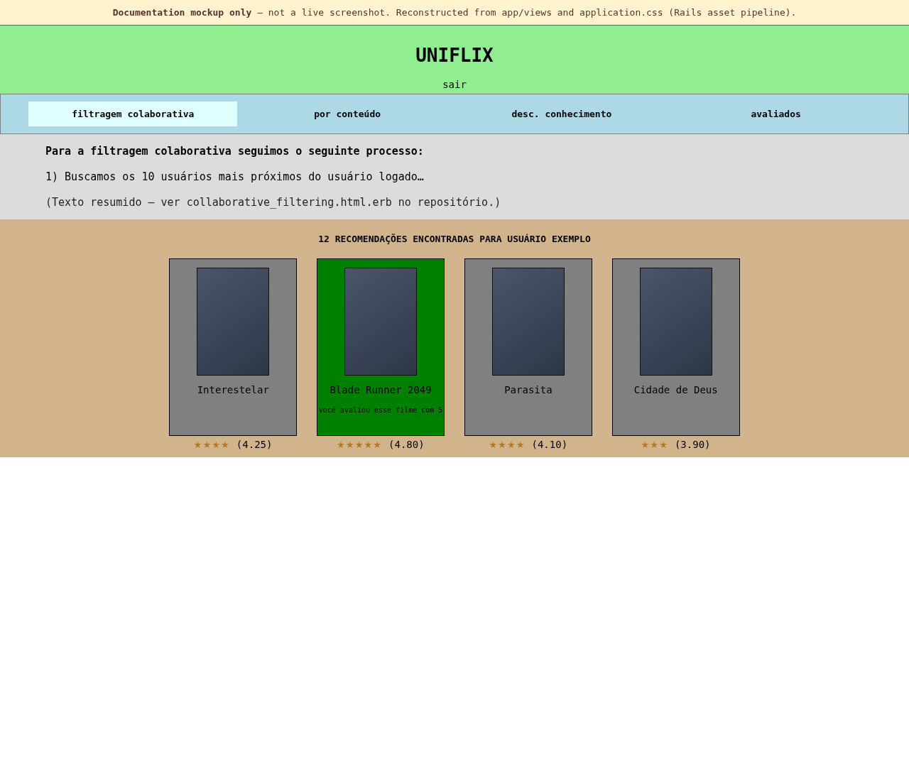

# UNIFLIX

Movie recommendation web app (Rails) developed as a final project for the **Collaborative Systems** course (EIA, UNIRIO). It implements several recommendation approaches over a catalog of movies.

*Interface preview reconstructed from the original project structure (static mockup in [`docs/uniflix-preview.html`](docs/uniflix-preview.html); not a live screenshot.)*

## Recommendation types

* Collaborative filtering (`movies/collaborative_filtering`)  
* Content-based filtering (`movies/content_based_filtering`)  
* Knowledge-discovery–style recommendations (`movies/past_filtering` — “desc. conhecimento” in the UI)  
* List of rated/liked titles (`movies#liked`)

